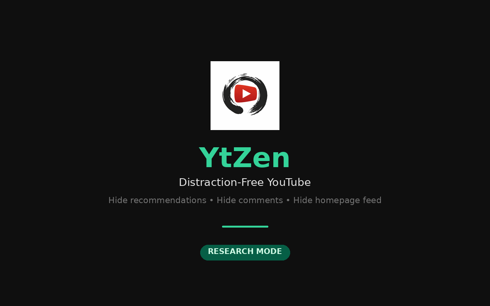
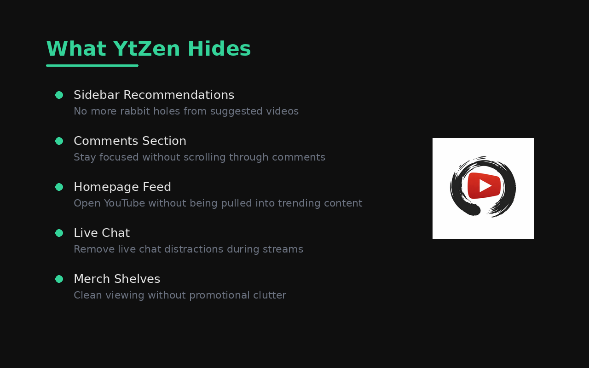
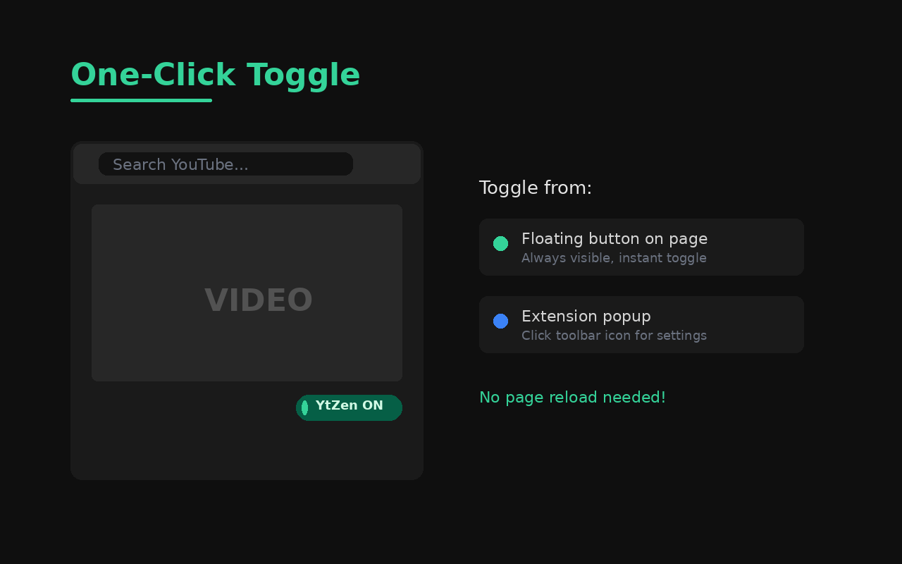
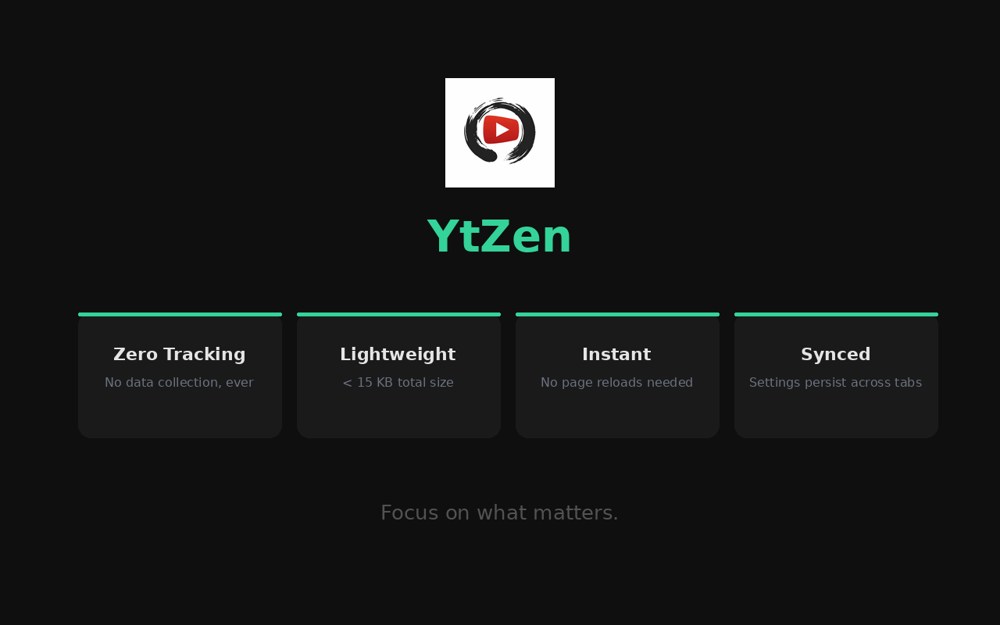

# YtZen — Distraction-Free YouTube

<p align="center">
  
</p>

<p align="center">
  <strong>Research Mode for YouTube.</strong><br>
  Hide recommendations, comments, and homepage feed with one click.
</p>

---

## What It Does

YtZen adds a **Research Mode** toggle to YouTube that instantly hides:

- **Sidebar recommendations** — no more rabbit holes
- **Comments section** — stay focused on the video
- **Homepage feed** — open YouTube without temptation
- **Live chat** — clean viewing during streams
- **Merch shelves** — no promotional clutter

Only the **search bar** and the **video you're watching** remain visible.

## Install

### Chrome Web Store

[**Install YtZen →**](https://chromewebstore.google.com/detail/ytzen)

### Manual / Developer

1. Clone or download this repo
2. Open `chrome://extensions`
3. Enable **Developer Mode**
4. Click **Load unpacked** → select the `ytzen` folder
5. Done — the YtZen icon appears in your toolbar

## How to Use

**Option A** — Click the **YtZen** icon in the Chrome toolbar and flip the toggle.

**Option B** — Use the floating **YtZen ON/OFF** button in the top-right corner of any YouTube page.

Research Mode activates instantly — no page reload needed. Your preference syncs across tabs and sessions.

## Screenshots

| Hero | Features | Toggle |
|:---:|:---:|:---:|
|  |  |  |

| Before vs After | Stats |
|:---:|:---:|
|  |  |

## Project Structure

```
ytzen/
├── manifest.json       # Chrome Extension Manifest V3
├── background.js       # Service worker for state persistence
├── content.js          # Core logic — hiding, toggle, MutationObserver
├── content.css         # Hidden class + floating button styles
├── popup.html          # Extension popup UI
├── popup.css           # Popup styling
├── popup.js            # Popup ↔ content script messaging
├── icons/              # Extension icons (16, 48, 128)
├── assets/             # Logo and favicon source files
├── screenshots/        # Chrome Web Store screenshots
└── PRIVACY.md          # Privacy policy
```

## Customization

To change which elements are hidden, edit the `SELECTORS_TO_HIDE` array at the top of `content.js`:

```js
const SELECTORS_TO_HIDE = [
  '#secondary',
  '#related',
  '#comments',
  'ytd-watch-next-secondary-results-renderer',
  'ytd-comments#comments',
  'ytd-rich-grid-renderer',
  // Add your own selectors here
];
```

## Tech

- Raw JavaScript — no frameworks, no dependencies
- CSS injection via `.ytzen-hidden { display: none !important; }`
- `MutationObserver` for YouTube's SPA navigation
- `chrome.storage.sync` for persistent, synced state
- Manifest V3

## Privacy

YtZen collects **zero** user data. The only thing stored is a single boolean (`on`/`off`) for your toggle preference. No analytics, no tracking, no network requests. See [PRIVACY.md](PRIVACY.md).

## License

MIT
